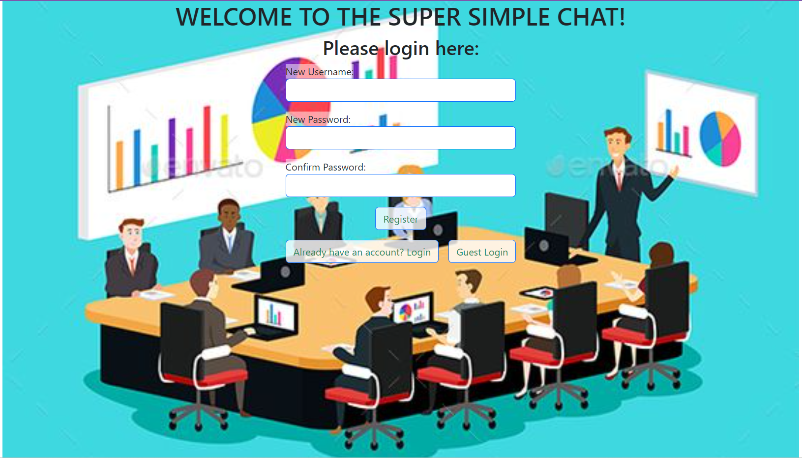

# **Super Simple Chat APP**

*A basic group chat app written in Javascript, HTML, CSS, and Python, using a PostgreSQL database*

You can run the program from [here](https://twitter-showcase-app-ucxm.onrender.com).
  

## **Summary**

<pre>
Development fundamentals in building a large scale project.  I started off with creating what I wanted it to look like and listing the features it will have.  I then start with the simple features first.and build out the UI.  I created a dummy list of users and messages to test the UI.  Then came the server portion.  I used Flask, because, well, I love Python and I also want to be able to practice programming in different languages and get the languages to work together complimenting each other.  I then managed to get the two talking to each other, and instead of the front end handling the registering and user logins as well as messages I now have the server doing it.  Then after the server was successfully handling calls from the UI, then came the juicy part, learning PostgreSQL.  I then created a simple database with two tables, one for users and one for messages and cross referenced the users to the messages.

I also learned what is important and what isn’t.  For example, when working with the messages, the message ID failed to update properly.  I didn’t bother wasting time to fix this because I knew that the database I was going to setup would handle the unique message IDs.

</pre>

#### **Author**

Asher Green - *Full Stack Developer* \
[website](http://ashergreen.ca) | [LinkedIn](https://www.linkedin.com/in/asher-green-6a96551/)
